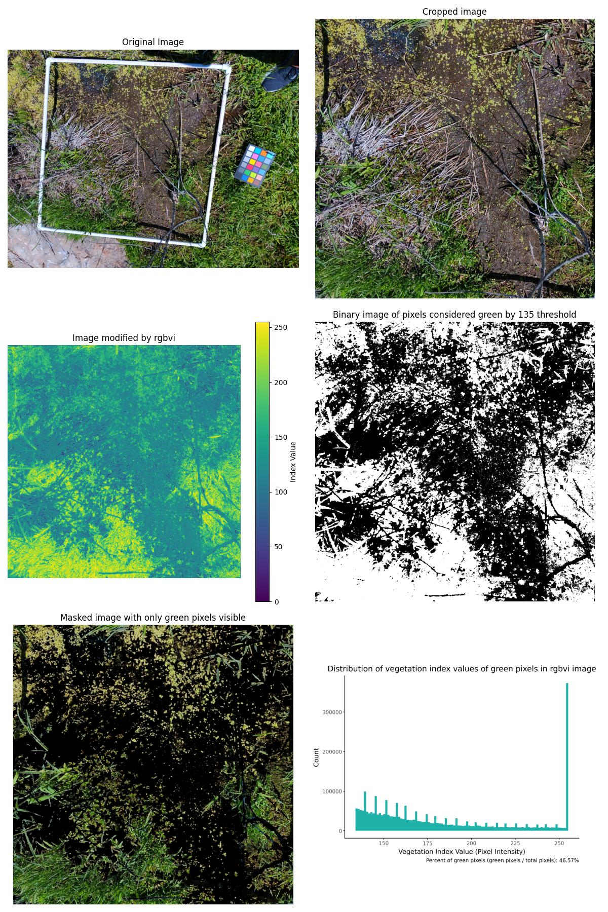

# mtech_reu_plants
 Professor Graff's REU project on automating vegetation surveys

## About the Project
The purpose of this project is to automate the process of measuring the health of plants in photos of the ground. The photos used are primarily images of the ground that contain quadrats (a 1x1 meter pvc pipe square, generally used to quantify a square meter of ground in ecological surveys). There are also some pictures of plucked willow leaves and stems on gray backgrounds.  

These photos can be found in the folders "raw_photos" and "test_photos_greenhouse."

### What is a vegetation index?
A vegetation index is an equation that tells you how "green" a pixel is. It is designed to identify crops and plants. The equation uses RGB channels (some equations involve near infrared channels. I used a phone camera for this project and did not have access to near infrared data, so I used the vegetation index equations that only involve RGB values.) to calculate a single value.
For example, this is the Red Green Blue Vegetation Index (RGBVI):
$RGBVI = \dfrac{G^2 - B*R}{G^2 - B*R}$

## Usage
The file called "master_script.py" will take the path to one image and return a grid of figures like the images below.  
 

It outputs several images representing steps in the editing process in addition to a histogram that displays the distribution of vegetation index values for every pixel. 
Parameters you can change in this function include:
- The vegetation index you'd like to use. Options: exg, exr, grvi, rgbvi, exg-exr
- The cutoff VI value that differentiates between green and not green. This may be different for each vegetative index and each set of photos, so experiment with different values. 
- Whether you want to crop your image to a square or not. The napari GUI allows you to place four corners, and the script will crop your image according to those corners. It uses a perspective transform to convert parallelograms / trapezoids into square. I used this feature to crop images to the quadrat, thus making every image cover one meter of ground. 
- Whether you want to denoise your image before processing it.

You can use the file "master_script_on_multiple_images" or your own for loop to run this process on all the images in a folder. 
All functions used by the master script are contained in the file "functions.py". It also contains other functions that I found useful during project development. 

## Tips
- The quadrat images were taken on the side of some trails and in some other grassy areas in Butte, Montana on sunny days. The data was collected haphazardly and not exhaustively. Therefore, when using your own photos, it is important to test for your own threshold values.
- Napari is designed for multidimensional images. When you're working with 2D images, be aware that the coordinates retrieved from your images are in the order (y, x) rather than (x, y). The "crop_to_square" function takes this into account by swapping the coordinates it retrieves ("matrix_xy_swap" function). I wasted a day figuring this out so you don't have to. 

## Acknowledgements