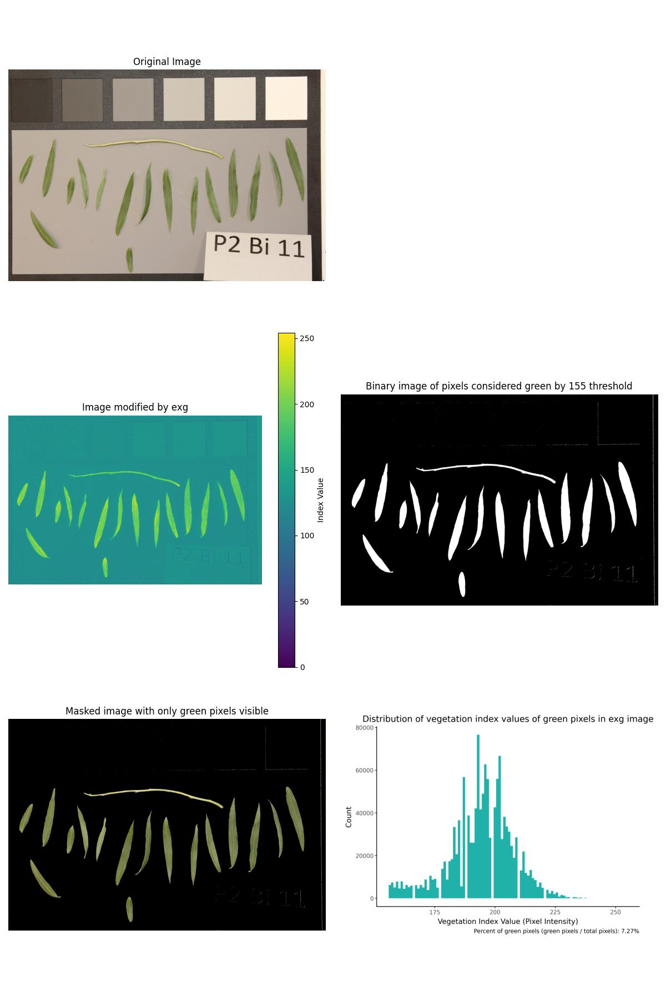

# mtech_reu_plants
 Professor Graff's REU project on automating vegetation surveys

## About the Project
The purpose of this project is to automate the process of segmenting images into categories - live plants and not. The photos used are primarily images of the ground that contain quadrats (a 1x1 meter pvc pipe square, generally used to quantify a square meter of ground in ecological surveys). There are also some pictures of plucked willow leaves and stems on gray backgrounds.  

These photos can be found in the folders "raw_photos" and "test_photos_greenhouse." Both are contained inside of the "photos" main folder. 

### What is a vegetation index?
A vegetation index is an equation that tells you how "green" a pixel is. It is designed to identify crops and plants. The equation uses RGB channels (some equations involve near infrared channels. The images used in this project were taken with phone cameras. I did not have access to near infrared data, so I used the vegetation index equations that only involve RGB values.) to calculate a single value.  
For example, this is the Red Green Blue Vegetation Index (RGBVI):  
  
When applied to an image, each pixel value becomes its vegetation index value. The result is a grayscale image where the lightest pixels are the ones considered the most green. 
For example, this is an image before and after being modified by the RGBVI.

Images modified by a vegetation index output as grayscale (each pixel has only one value), but if you view / save the images with the Matplotlib library like in these examples, they output with the viridis color map by default. 

### What is thresholding?
Thresholding is an image analysis technique that segments out parts of an image where the pixel values are over a threshold. For example, when using the RGBVI, pixels with values greater than 135 generally correspond to plant matter. So I used a threshold of 135 for my RGBVI images.

## Guide to the files and usage
### functions.py
This file contains all the functions I used during this project. The first three are functions used in the main process. The rest are miscellaneous functions that proved useful during development. 

### master_script.py
This script will run the main process on one image. Start with this one because the main function walks you through the process. 

### master_script_on_multiple_images.py
This script contains a for loop so you can input a folder of images and get a result for each one of them.

### development_files
This folder contains miscellaneous files I used in development. They can potentially be useful for learning more about the techniques used in this project. Some are unsuccessful experiments that could be taken further. segment_and_analyze_rocks.ipynb, for example, was the file where I tried to use segmentation to isolate rocks and record data about them. I didn't have time to figure it out, but maybe someone else will.
These files are older, and a lot of them came before some major reorganizations. I updated all the paths I could, but be aware that I may have missed a few. Don't be alarmed by filenotfound errors - just update the path to something that works for you.
- sandbox.ipynb:
    This notebook contains a lot of the code I wrote while going through digitalsreeni's Python for Microscopy tutorials. It is organized with headers so it can be a resource for skills I learned from Sreeni.
- "how_to" files:
    These are similar to the sandbox - used for learning new skills and can be used for reference
- The rest of the development files: 
    These files are the places where I tested various methods on the test photos. 

### photos
This folder contains all the images used for this project. The test photos are a haphazard subset that I used to test image analysis techniques. The greenhouse images are the photos of willow leaves and stems on gray backgrounds. I took all the photos of the quadrats and ground, and the greenhouse images were produced by Joel Graff's research.

### presentation_images
Images I used for presentation and the readme and stuff. Good for learning about the project and what it does. 

### results
This is where I outputted the results of all my programs. The master_script_output folder is where the results of the main process are, but the other folders contain results of various tests and experiments I did during development. 

The file called "master_script.py" will take the path to one image and return a grid of figures like the images below.  
 

It outputs several images representing steps in the editing process in addition to a histogram that displays the distribution of vegetation index values for every pixel. 
Parameters you can change in this function include:
- The vegetation index you'd like to use. Options: exg, exr, grvi, rgbvi, exg-exr
- The cutoff VI value that differentiates between green and not green. This may be different for each vegetative index and each set of photos, so experiment with different values. 
- Whether you want to crop your image to a square or not. The napari GUI allows you to place four corners, and the script will crop your image according to those corners. It uses a perspective transform to convert parallelograms / trapezoids into square. I used this feature to crop images to the quadrat, thus making every image cover one meter of ground. 
- Whether you want to denoise your image before processing it.

You can use the file "master_script_on_multiple_images" or your own for loop to run this process on all the images in a folder. 
All functions used by the master script are contained in the file "functions.py". It also contains other functions that I found useful during project development. 

## Tips
- The quadrat images were taken on the side of some trails and in some other grassy areas in Butte, Montana on sunny days. The data was collected haphazardly and not exhaustively. Therefore, when using your own photos, it is important to test for your own threshold values.
- Napari is designed for multidimensional images. When you're working with 2D images, be aware that the coordinates retrieved from your images are in the order (y, x) rather than (x, y). The "crop_to_square" function takes this into account by swapping the coordinates it retrieves ("matrix_xy_swap" function). I wasted a day figuring this out so you don't have to. 

## Acknowledgements